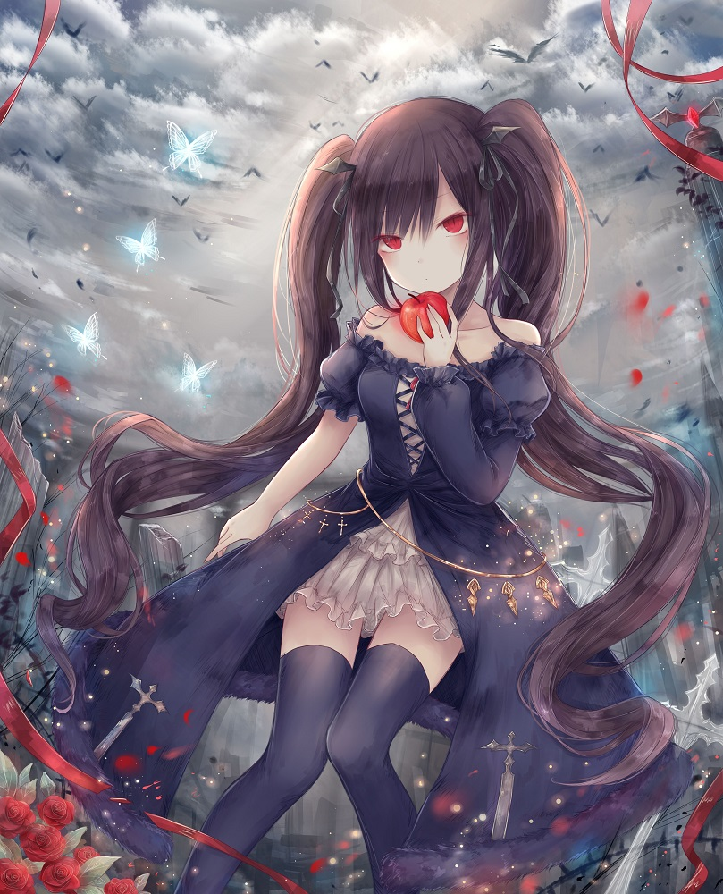
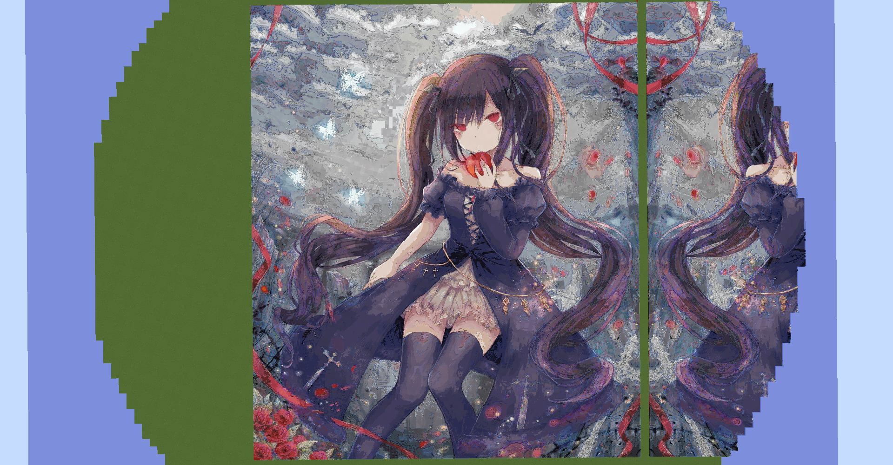
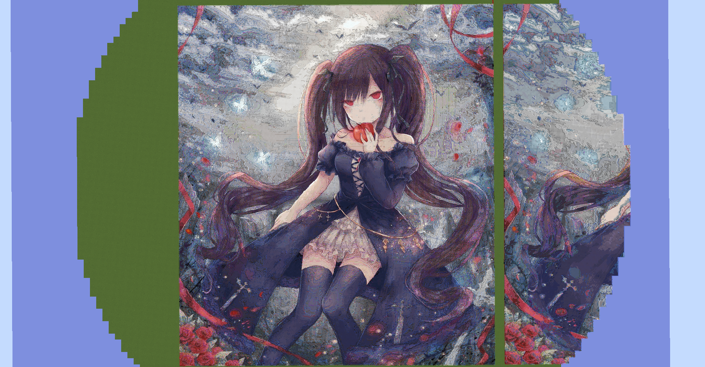

# Minecraft Pixel Art Generator
## Описание
Программа для генерации пиксель арта для игры Minecraft по загруженному изображению. В качестве результата генерируется последовательность команд "/setblock". Результат сохраняется в папку image.  
Для расширения палитры программа строит многослойные арты (цветное стекло на верхних слоях), количество слоёв является настраивамым параметром.  
Программа работает на Windows и использует библиотеку OpenCV. Результат сохраняется в папку image.  
## Примеры
В качестве изображения была передана следующая картинка:  
  
Полученный двуслойный арт:
  
Полученный трёхслойный арт:
  
